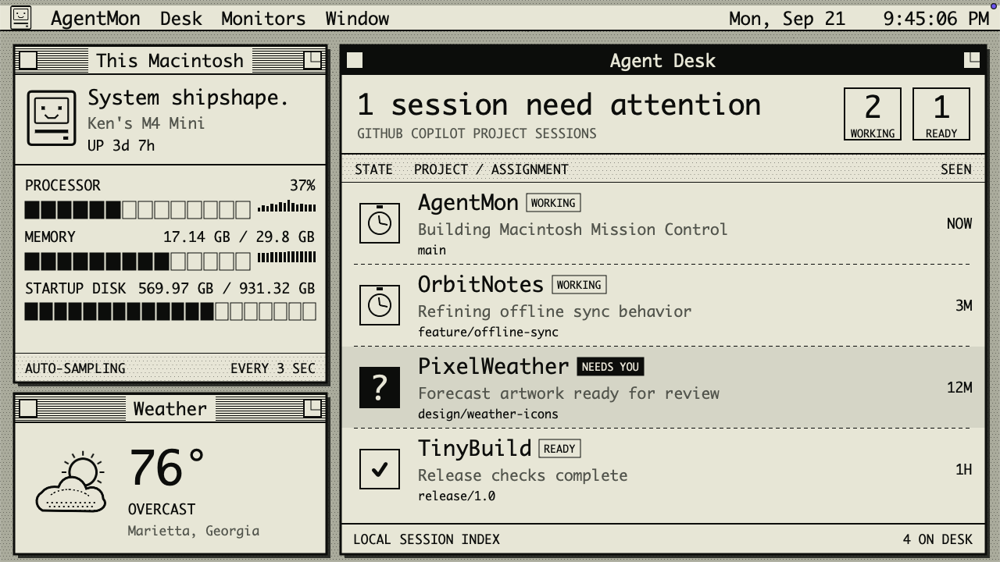

<p align="center">
  
</p>

<h1 align="center">AgentMon</h1>

<p align="center">
  A tiny Macintosh mission-control center for your Mac and GitHub Copilot agents.
</p>

<p align="center">
  <a href="https://github.com/VeryKross/AgentMon/actions/workflows/ci.yml"></a>
  
  
</p>



AgentMon turns a dedicated 1280×720 display into an always-on, glanceable view of what your Mac—and your coding agents—are doing. Its interface is built as a working System 6 desktop rather than a modern dashboard with a retro theme pasted over it.

## Highlights

- **Live Mac health:** processor load, memory use, startup-disk use, and uptime
- **Copilot session desk:** active and recent GitHub Copilot project sessions, repositories, branches, and activity
- **Attention state:** visually inverts a session when Copilot is waiting for an answer
- **Local weather:** keyless weather from [Open-Meteo](https://open-meteo.com/), defaulting to Marietta, Georgia 30066
- **Dedicated-display mode:** automatically fills the first secondary display at its native resolution
- **Native menu-bar controls:** reopen the dashboard, switch display modes, change settings, or quit
- **One-bit design:** Monaco typography, stipple patterns, MacPaint-style artwork, and crisp structural shadows

## Privacy

System metrics and Copilot session metadata are read locally. AgentMon only inspects the metadata needed to identify a project, branch, recency, and state. It does not upload project names, prompts, source code, or session content.

The configured location is sent to Open-Meteo's geocoding and forecast APIs. No API key is required.

## Install

AgentMon currently builds from source and requires macOS 14 or later with Xcode 16 or later installed.

```sh
git clone https://github.com/VeryKross/AgentMon.git
cd AgentMon
make dmg
open dist/AgentMon.dmg
```

Drag **AgentMon** into the **Applications** shortcut in the disk image, then launch it from Applications. Without a signing identity, locally built bundles are ad-hoc signed.

To sign the app and disk image with an installed Developer ID certificate:

```sh
CODESIGN_IDENTITY="Developer ID Application: Your Company (TEAMID)" make dmg
```

Developer ID builds use Apple's hardened runtime and secure timestamps. Signing alone does not notarize the disk image; public release downloads should also be submitted to Apple's notarization service and stapled.

To build only the application bundle:

```sh
make app
open .build/AgentMon.app
```

For development:

```sh
make run
```

Use `make demo` to run the sanitized sample state used for repository screenshots.

## Configuration

Open the AgentMon menu-bar item and choose **Settings…** to change:

- The computer name shown in the system window
- Whether AgentMon fills the secondary display automatically
- The town, city, or ZIP code used for weather

The menu-bar item can also return AgentMon to a normal resizable window.

## How agent status works

AgentMon reads workspace metadata and recent event types under `~/.copilot/session-state`. Session content is not displayed or transmitted. The adapter recognizes four states:

| State | Meaning |
|---|---|
| **WORKING** | An active Copilot turn is running |
| **NEEDS YOU** | A session is waiting for user input |
| **READY** | The session is open and idle |
| **ASLEEP** | The session process is no longer active |

This directory is an implementation detail of GitHub Copilot rather than a public API, so the reader is isolated in `CopilotSessionMonitor.swift`.

## Build commands

| Command | Result |
|---|---|
| `make test` | Builds the project and runs the test suite |
| `make app` | Produces `.build/AgentMon.app` |
| `make dmg` | Produces `dist/AgentMon.dmg` |
| `make run` | Runs AgentMon from Swift Package Manager |
| `make demo` | Runs with sanitized sample data |

## Project structure

```text
Sources/AgentMon/
├── AgentMonApp.swift          # Window, menu-bar, and display lifecycle
├── DashboardModel.swift       # Refresh cadence and presentation state
├── DashboardView.swift        # 1280×720 Macintosh Mission Control UI
├── SystemMonitor.swift        # Native CPU, memory, disk, and uptime metrics
├── CopilotSessionMonitor.swift
├── WeatherService.swift
├── RetroComponents.swift
└── RetroTheme.swift
```

AgentMon has no third-party runtime dependencies.
