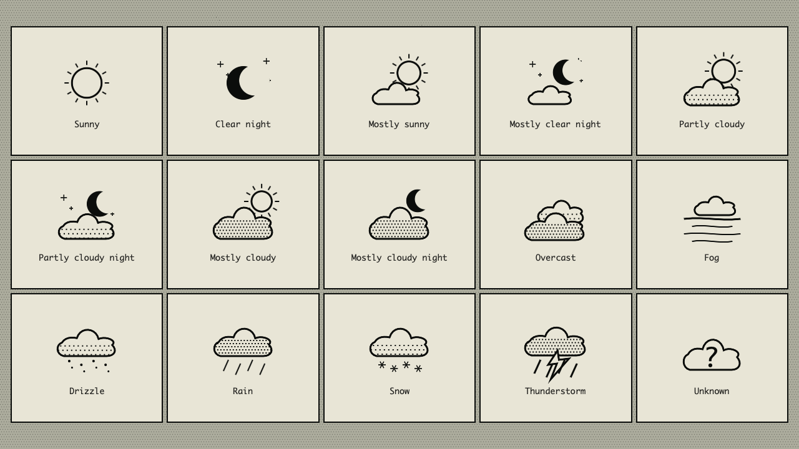

<p align="center">
  
</p>

<h1 align="center">AgentMon</h1>

<p align="center">
  A tiny Macintosh mission-control center for your Mac and GitHub Copilot agents.
</p>

<p align="center">
  <a href="https://github.com/VeryKross/AgentMon/actions/workflows/ci.yml"></a>
  <a href="https://github.com/VeryKross/AgentMon/releases/latest"></a>
  
  
</p>


AgentMon turns a dedicated 1280×720 display into an always-on, glanceable view of what your Mac—and your coding agents—are doing. Its interface is built as a working System 6 desktop rather than a modern dashboard with a retro theme pasted over it.

## Highlights

- **Live Mac health:** processor load, memory use, startup-disk use, and uptime
- **Copilot session desk:** active and recent GitHub Copilot project sessions, repositories, branches, and activity
- **Cross-computer view:** merges sessions from a securely paired Windows relay into one prioritized Agent Desk
- **Attention state:** visually inverts a session when Copilot is waiting for an answer
- **Local weather:** keyless temperature data from [Open-Meteo](https://open-meteo.com/) with fresh U.S. sky observations from the [National Weather Service](https://www.weather.gov/), defaulting to Marietta, Georgia 30066
- **Glanceable weather artwork:** distinct MacPaint-style scenes for sky coverage, day and night, fog, drizzle, rain, snow, and thunderstorms
- **Dedicated-display mode:** automatically fills the first secondary display at its native resolution
- **Native menu-bar controls:** reopen the dashboard, switch display modes, change settings, or quit
- **One-bit design:** Monaco typography, stipple patterns, MacPaint-style artwork, and crisp structural shadows

## Privacy

System metrics and local Copilot session metadata are read on the Mac. A paired relay sends only normalized project, repository, branch, recency, and activity metadata over certificate-pinned HTTPS. Prompts, source code, tool payloads, and raw event records never cross the network.

The configured location is sent to the weather providers. Open-Meteo supplies temperature and worldwide fallback conditions. U.S. ZIP codes are resolved through [Zippopotam.us](https://www.zippopotam.us/), and fresh sky conditions come from nearby National Weather Service observation stations. No API keys are required.

## Weather artwork

Every condition family has its own one-bit scene, including progressively heavier cloud coverage, day and night variants, fog bands, drizzle, rain, snow, and lightning.



## Install

Download the signed and notarized [`AgentMon.dmg`](https://github.com/VeryKross/AgentMon/releases/latest/download/AgentMon.dmg) from the latest release. Open the disk image, then drag **AgentMon** into **Applications**.

Release builds are signed with **Developer ID Application: Ken Ross (KRFKA47WU3)**, notarized by Apple, and stapled for offline Gatekeeper verification. A SHA-256 checksum is published beside each DMG.

### Build from source

Source builds require macOS 14 or later with Xcode 16 or later installed.

```sh
git clone https://github.com/VeryKross/AgentMon.git
cd AgentMon
make dmg
open dist/AgentMon.dmg
```

Without a signing identity, locally built bundles are ad-hoc signed.

To sign the app and disk image with an installed Developer ID certificate:

```sh
CODESIGN_IDENTITY="Developer ID Application: Your Company (TEAMID)" make dmg
```

Developer ID builds use Apple's hardened runtime and secure timestamps. To also submit and staple both the app and disk image using a saved `notarytool` Keychain profile:

```sh
CODESIGN_IDENTITY="Developer ID Application: Your Name (TEAMID)" \
NOTARY_PROFILE="AgentMonNotary" \
make dmg
```

To build only the application bundle:

```sh
make app
open .build/AgentMon.app
```

For development:

```sh
make run
```

Use `make demo` to run the sanitized sample state used for repository screenshots.

## Configuration

Open the AgentMon menu-bar item and choose **Settings…** to change:

- The computer name shown in the system window
- Whether AgentMon fills the secondary display automatically
- The town, city, or ZIP code used for weather

The menu-bar item can also return AgentMon to a normal resizable window.

## Windows relay

AgentMon can merge sessions from a Windows companion on the same private network. In **Settings → Windows Relay**, enter the relay's HTTPS URL, certificate SHA-256 fingerprint, and pairing token. The token is stored in this Mac's Keychain; a changed certificate fails closed until explicitly paired again.

The versioned contract is documented in [`docs/relay-protocol-v1.md`](docs/relay-protocol-v1.md). It defines the privacy boundary, authenticated transport, snapshot fields, activity semantics, freshness requirements, and expected HTTP behavior.

The native Windows companion lives in `Relay/AgentMon.Relay.Windows`. It provides
a tray UI, protected persistent pairing credentials, a Private-network-only HTTPS
listener, and bounded local Copilot indexing. Download a versioned x64 or ARM64
installer and matching SHA-256 checksum from the Windows Relay workflow's
artifacts. Setup installs per-user, adds a Start menu shortcut, and preserves
pairing through upgrades. Portable ZIPs remain available. No separately
installed .NET runtime is required.

See [Windows installation, pairing, privacy, and removal](docs/windows-relay.md).
Windows artifacts identify whether they are signed or unsigned; unsigned builds
are development/release candidates, not trusted signed releases. Follow your
software approval policy without disabling Windows security. IPv4 private LANs
are supported; network-profile changes, startup, and the narrowly scoped
firewall rule remain explicit actions. Uninstall preserves pairing by default
and offers a separate, explicit complete privacy reset.

## How agent status works

For local sessions, AgentMon reads workspace metadata and recent event types under `~/.copilot/session-state`. Remote relays apply the same derivation locally and transmit only the resulting normalized state. The adapters recognize four states:

| State | Meaning |
|---|---|
| **WORKING** | An active Copilot turn is running |
| **NEEDS YOU** | A session is waiting for user input |
| **READY** | The session is open and idle |
| **ASLEEP** | The session process is no longer active |

This directory is an implementation detail of GitHub Copilot rather than a public API, so the reader is isolated in `CopilotSessionMonitor.swift`.

## Build commands

| Command | Result |
|---|---|
| `make test` | Builds the project and runs the test suite |
| `make test-relay` | Verifies authenticated, certificate-pinned HTTPS against a local mock relay |
| `python3 -B -m unittest discover -s scripts -p test_mock_relay.py` | Tests HTTPS mock authentication and idle-connection handling without Swift |
| `make app` | Produces `.build/AgentMon.app` |
| `make dmg` | Produces `dist/AgentMon.dmg` |
| `make run` | Runs AgentMon from Swift Package Manager |
| `make demo` | Runs with sanitized sample data |
| `.\scripts\publish-relay.ps1` (Windows) | Produces a self-contained Windows x64 relay ZIP and checksum |
| `.\scripts\install-inno-setup.ps1`, then `.\scripts\publish-relay.ps1 -Installer` | Produces a per-user installer alongside the portable ZIP, both with checksums |

## Project structure

```text
Sources/AgentMon/
├── AgentMonApp.swift          # Window, menu-bar, and display lifecycle
├── DashboardModel.swift       # Refresh cadence and presentation state
├── DashboardView.swift        # 1280×720 Macintosh Mission Control UI
├── SystemMonitor.swift        # Native CPU, memory, disk, and uptime metrics
├── CopilotSessionMonitor.swift
├── RelayClient.swift           # Pinned-HTTPS relay transport and Keychain token
├── RelayProtocol.swift         # Versioned cross-platform snapshot contract
├── WeatherService.swift
├── WeatherGlyph.swift          # One-bit condition artwork
├── RetroComponents.swift
└── RetroTheme.swift
```

The macOS app has no third-party runtime dependencies. The Windows companion
bundles .NET 8 and YamlDotNet; see `Relay/THIRD-PARTY-NOTICES.txt`.
